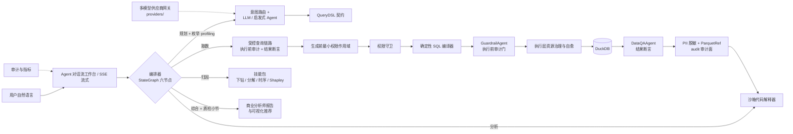
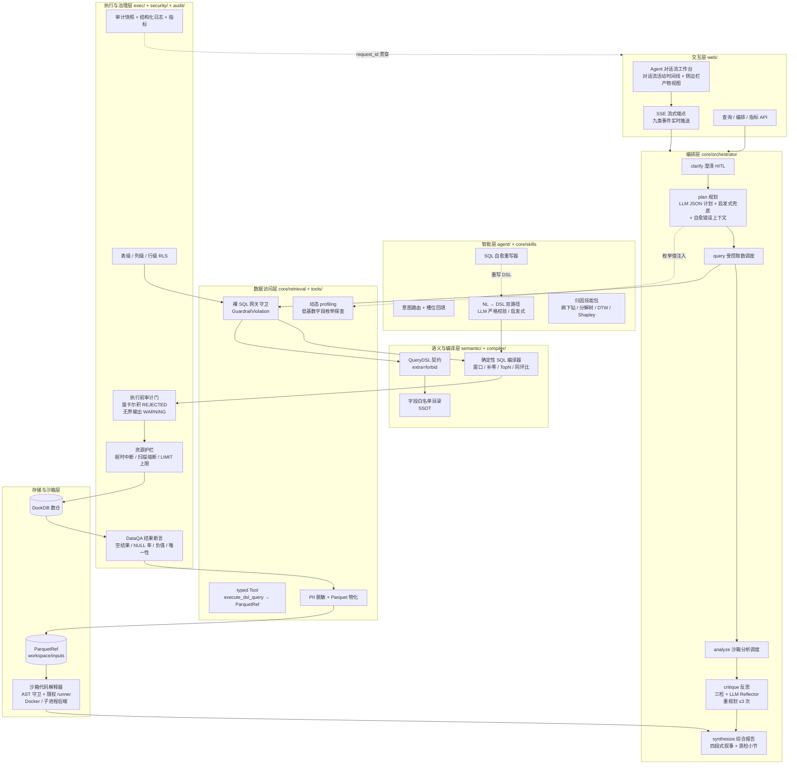
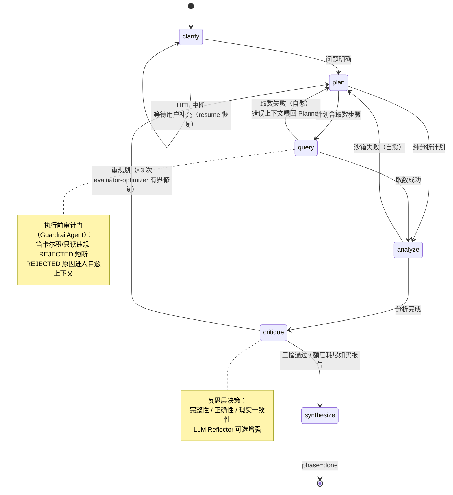

# 架构与设计

## 架构总览

DataAgent 在"受控 DSL → 确定性 SQL"核心链路之上，叠加图式编排、沙箱分析、归因技能与多模型供应商网关，构成企业级 Data Agent：



编排器的六节点为：澄清 HITL → 规划 → 受控取数 → 沙箱分析 → 反思重规划（≤3 次受控自愈）→ 综合报告；计划为步骤 DAG，全过程经 SSE 以九类事件实时推送。重规划时最近失败摘要（error_context）注入 Planner 提示词——自愈是针对性修正而非盲重试。

## 多角色架构对齐（pi-agent-harness）

对标 pi-agent-harness 的多角色团队架构（5 核心角色 + Chain/Evaluator-Optimizer 编排），DataAgent 的角色落位如下。与 Harness 的差异点：**安全裁决与结果质检由确定性代码承担而非 LLM**——符合"LLM 仅产 DSL"铁律，结论可复现、可单测、零幻觉。

| 角色 | 职能 | DataAgent 实现 | 核心文件 |
| --- | --- | --- | --- |
| SchemaAgent | 元数据探查 + 动态 profiling | 语义目录 SSOT 静态注入 + 低基数字段枚举值探查（进程级缓存、失败降级） | `semantic/catalog.py`、`core/retrieval/profiling.py` |
| SqlEngineer | 方言感知只读 SQL 生成 | Planner 产 DSL 契约 JSON → 确定性编译器生成 SQL（LLM 永不产出裸 SQL，强于基线） | `core/orchestrator/nodes.py`、`compiler/sql_compiler.py` |
| GuardrailAgent | 执行前安全与执行计划审计 | 裸 SQL 网关四层防线 + 执行前静态审计（笛卡尔积/只读结构 REJECTED、无界输出 WARNING）+ EXPLAIN ANALYZE 扫描熔断 | `core/retrieval/guardrails.py`、`exec/audit.py`、`exec/guards.py` |
| DataQAAgent | 结果断言与数据质量质检 | 四类确定性质检（空结果/NULL 率/负值/维度唯一性），双取数链路同源 | `core/retrieval/quality.py`、`tools/builtins/_query_core.py` |
| VizAgent | 图表渲染与叙事 | 确定性图表推荐（number/line/bar/pie/pivot/table + ECharts option 契约）+ 商业分析师四段式报告 | `present/viz.py`、`core/orchestrator/nodes.py`（synthesize） |
| Orchestrator | Chain-of-Delegation 主编排 | StateGraph 条件边（chain 委托）+ critic 重规划 ≤3（evaluator-optimizer 有界修复）+ clarify HITL 检查点 + 事件总线审计轨迹 | `core/orchestrator/` |

## 分层职能架构图



## 编排状态机（Chain-of-Delegation）



## 受控查询防御管线

每一次取数（编排链路与 web 链路同源）经过的完整防线序列与失败处置：

```mermaid
flowchart LR
    DSL[QueryDSL 载荷] --> V1[网关校验<br>裸 SQL / 非法形态 / 契约重建<br>失败: GuardrailViolation]
    V1 --> V2[RLS 策略注入<br>表/列/行级]
    V2 --> V3[确定性编译<br>字段白名单 + 受限操作符<br>失败: CompileError]
    V3 --> V4[执行前审计门<br>笛卡尔积/只读结构 REJECTED<br>无界输出 WARNING]
    V4 --> V5[EXPLAIN ANALYZE 预检<br>扫描行数熔断<br>失败: MaxRowsScannedExceeded]
    V5 --> V6[受控执行<br>超时中断 + LIMIT 硬上限]
    V6 --> V7[DataQA 结果断言<br>空结果 / NULL 率 / 负值 / 维度唯一性<br>发现分级留痕 + 随产物输出]
    V7 --> V8[PII 脱敏 + Parquet 物化<br>sha256 可审计]
    V8 --> REF[ParquetRef<br>audit={guard, qa} 审计面]

    V3 -.编译/执行报错.-> HEAL[SQL 自愈重写<br>错误喂回 LLM 改写 DSL<br>上限 SQL_SELF_HEAL_MAX_RETRIES]
    V5 -.熔断原因.-> HEAL
    HEAL -.重写后重过全链路.-> V1
```

**审计发现的数据流**：`ParquetRef.audit` → ① SSE `tool_end` 事件（前端数据审计 Tab）→ ② 编排 scratchpad（进入 critic 反思视野）→ ③ synthesize 报告"数据质检"小节（用户可见）→ ④ 结构化日志分级采集（采集器告警）。QA 发现不自动否决执行——空结果可能是合法答案，处置权在 critic 与报告层（不误杀、不吞错）。

## 核心原则

- **受限生成**：LLM 只输出契约内 JSON；Pydantic 模型使用 `extra="forbid"`。
- **确定性编译**：SQL 只由 `compiler/sql_compiler.py` 生成，不接受模型直接提交裸 SQL。
- **裸 SQL 三重防线**：字符串载荷 / SQL 键 / 自由文本 SQL 形态在网关层直接拒绝（`GuardrailViolation`），"LLM 永不产出裸 SQL"贯穿主链路与编排层。
- **语义白名单**：逻辑字段必须登记在 `semantic/catalog.py`，Join 由目录规则控制。
- **纵深防御**：生成前注入主体可见字段，生成后再经过表级、列级与行级策略校验。
- **执行前审计门**：编译产物 SQL 在执行前经静态审计（笛卡尔积 / 只读结构 REJECTED 熔断、无界输出 WARNING 轨迹）——审计作为编译器不变式防御，REJECTED 原因进入自愈上下文。
- **结果断言层**：执行后、展示前对原始结果做四类确定性质检，发现随 ParquetRef 审计面全链路可见（事件 / critic / 报告 / 日志），不自动改写路由。
- **受控自愈**：编译/执行报错与审计拒绝喂回重写（web 链路 ≤ `SQL_SELF_HEAL_MAX_RETRIES`，编排链路重规划 ≤3）；重规划时错误上下文注入 Planner——自愈是针对性修正而非盲重试。
- **沙箱隔离**：沙箱代码解释器经 AST 静态守卫 + 限权 runner（模块白名单 import、workspace 受限 open）+ 可插拔后端（Docker `--net=none --cap-drop=ALL` 强隔离 / 子进程兜底）执行；取数结果 PII 脱敏后物化为 ParquetRef（sha256 可审计），沙箱零网络、零 DB socket，聚合矩阵 ≤100 行防数据外泄。
- **可追溯交付**：查询结果同时提供 DSL、SQL、中文解释、可视化建议、审计记录与数据质检发现。

## 技术栈

| 组件 | 选型 |
| --- | --- |
| 语言 | Python 3.11+（项目环境使用 Python 3.12） |
| 数据校验 | Pydantic V2 |
| 本地数仓 | DuckDB |
| 图式编排 | StateGraph 六节点（条件边 + HITL 中断恢复） |
| 静态审计 | sqlglot AST（只读结构 / 笛卡尔积 / 无界输出） |
| 沙箱后端 | Docker 强隔离 / 子进程兜底（可插拔） |
| 模型接入 | 多供应商网关：OpenAI Chat / Responses、Anthropic、Gemini 协议适配 |
| Web | Python 标准库 `http.server` + 原生 JS Agent 对话流工作台（vendored ECharts / PrismJS，零前端框架） |
| 质量 | pytest、black、ruff、Golden Dataset |

## 全链路能力

| 层级 | 关键能力 | 入口 |
| --- | --- | --- |
| 语义 | 聚合、比率、时间过滤、窗口指标、日期补零、分组 Top-N | `semantic/` |
| Agent | LLM / 启发式双路径、意图路由、RAG、澄清与多轮槽位回填、观察驱动重规划、对比分解综合、反思层、自愈错误上下文注入 | `agent/` |
| 编排 | StateGraph 六节点、步骤 DAG 计划、HITL 澄清中断恢复、反思重规划 ≤3 次自愈（错误上下文感知）、九类 SSE 事件 | `core/orchestrator/` |
| 取数 | DSL 管道 typed Tool 化、PII 脱敏（列名启发式 + 值形态正则）、ParquetRef 物化（audit 审计面）、裸 SQL 网关守卫、动态 profiling（低基数字段枚举值） | `core/retrieval/` |
| 质检 | DataQA 四类结果断言（空结果 / NULL 率 / 负值 / 维度唯一性），编排与 web 双链路同源，发现分级留痕 | `core/retrieval/quality.py` |
| 执行前审计 | 笛卡尔积 / 只读结构 REJECTED 熔断、无界输出 WARNING 轨迹（GuardrailAgent 角色） | `exec/audit.py` |
| 沙箱 | AST 静态守卫、限权 runner、Docker/子进程可插拔后端 | `core/sandbox/` |
| 技能 | 熵下钻、乘法/加法指标分解树、DTW 相似性、Holt-Winters 异常检测、Shapley 值归因 | `core/skills/` |
| 模型网关 | 多供应商 CRUD（Key 落盘加密不回传）、连通性探测、请求级模型切换 | `providers/` |
| 编译 | 确定性 DuckDB SQL、同比/环比、多事实表受控 Join | `compiler/` |
| 执行 | 只读白名单、执行前审计门、超时取消、扫描/结果熔断、SQL 自愈、连接池 | `exec/` |
| 展示 | 商业分析师四段式报告、数据质检小节、中文业务解释、number/line/bar/pie/pivot/table 推荐 | `present/` `core/orchestrator/nodes.py` |
| 治理 | 认证、作用域、表/列/RLS、审计、结构化 JSON 日志（request_id 贯穿）、指标 | `auth/` `security/` `audit/` |
| 交付 | Agent 对话流工作台、健康检查、查询 API、编排端点、指标 API | `web/` |

## 可观测性

三条互补的可观测通道，全部以 request_id / session_id 贯穿：

1. **结构化日志**（`audit/logging.py`，JSON 单行输出）：级别纪律——`error` = 熔断 / 审计拒绝 / 自愈额度耗尽终止 / QA error 级发现（可告警）；`warning` = 可自愈报错 / 降级路径（NL→DSL 降级、profiling 降级、LLM 调用失败走兜底）；`info` = HITL 中断 / 编排完成摘要 / 自愈重写成功。覆盖执行层、检索层、编排层与 web 自愈链路的全部异常路径。
2. **SSE 事件流**（九类事件）：plan_created / step_start / tool_start / tool_end（含审计预览与 guard/qa findings）/ reflection / hitl_request / artifact_emit / done / error——前端任务时间线与数据审计 Tab 的数据源。
3. **审计快照与指标**（`audit/`）：查询审计记录、QPS / 分位数指标、自愈失败计数（`record_self_heal_failure`）。

更多运行步骤、配置与接口说明见：

- [快速开始](quickstart.md)
- [环境配置](configuration.md)
- [API 参考](api.md)
